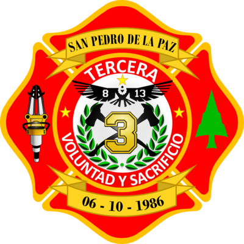

# Inventario - Tercera Compañía

Este proyecto es una aplicación de gestión de inventario para la Tercera Compañía de Bomberos. Permite la administración de productos, usuarios y bodegas, con una interfaz gráfica amigable desarrollada en Java.

## 📦 Descarga

Descarga el archivo JAR ejecutable para utilizar la aplicación:

- [**Descargar inventarioBomb.jar**](https://github.com/Pixuh/Inventario-Tercera-Compa-ia/raw/main/release/inventarioBomb.jar)

## 🚀 Requisitos

Para ejecutar el archivo JAR, asegúrate de tener instalado:
- [Java JDK](https://www.oracle.com/java/technologies/javase-jdk11-downloads.html) (versión 11 o superior).

## 🛠️ Ejecución

1. Descarga el archivo JAR desde el enlace anterior.
2. Ejecuta el archivo:
   - **Windows:** Haz doble clic en el archivo `inventarioBomb.jar`.
   - **Terminal/Consola:**
     ```bash
     java -jar inventarioBomb.jar
     ```

## 📚 Funcionalidades

- Gestión de inventarios.
- Administración de bodegas principales y subbodegas.
- Manejo de usuarios con roles de **admin** y **usuario**.

## 🌟 Capturas de Pantalla



## 📝 Licencia

Este proyecto es de uso interno y está protegido bajo los derechos de la Tercera Compañía.

---

### **Pasos para añadirlo al repositorio:**

1. **Crea un archivo README.md** en la raíz del proyecto:
   ```bash
   touch README.md
